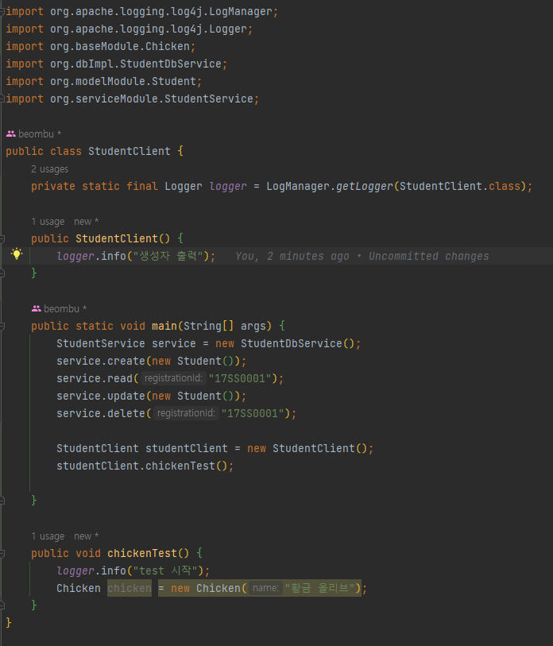

## 모듈과 패키지의 차이

패키지 : 하나의 디렉토리로 클래스의 묶음이다.
비슷한 성격의 클래스 모음
> 상위 패키지.하위패키지.클래스

모듈 : 외부에서 재사용할 수 있는 패키지들의 묶음
패키지의 상위 개념
다른 프로젝트가 import, export를 이용해 주고 받는다.

모듈의 목적
1. 모둘 간의 종속성을 명시적으로 선언
2. 강력한 캡슐화
3. 모듈 간의 느슨한 결합
4. 성능 항샹

## 모듈이 생긴 이유

1. 패키지의 캡슐화가 완벽하지 않다.
패키지는 공개 또는 비공개만 둘 중 하나만 선택이 가능해 공개하면 너무 자유로워지고, 비공개하면 다른 곳에서 아예 사용 x

2. 빌드 단계에서 프로그램 구동에 필요한 모든 클래스가 있는지 확인 할 수가 없다.
동적 로딩으로 속도를 얻었지만 실행 직후에 누락을 알 수 없다는 단점이 있다.

3. 런타임이 거대해져 배포가 어려워졌다.
자바가 커지면서 다양한 기능(클래스)들이 많아지면서 런타임.jar이 너무 커졌다.

## api vs implementation
- 둘 다 의존성을 관리하기 위한 방식이다.
- 컴파일, 런타임, 테스팅 등 모두 실행 시에 사용한다.
- implementation는 의존 라이브러리 수정시 본 모듈까지만 재빌드한다.
- api는 의존 라이브러리 수정시 본 모듈을 의존하는 모듈들도 재빌드

implementation을 사용하는 경우,

A라는 모듈을 수정하게 되면, 이 모듈을 직접 의존하고 있는 B만 재빌드 한다.

api를 사용하는 경우,

A라는 모듈을 수정하게 되면, 이 모듈을 **직접 혹은 간접 의존**하고 있는 B와 C는 모두 재빌드 되어야 한다.

